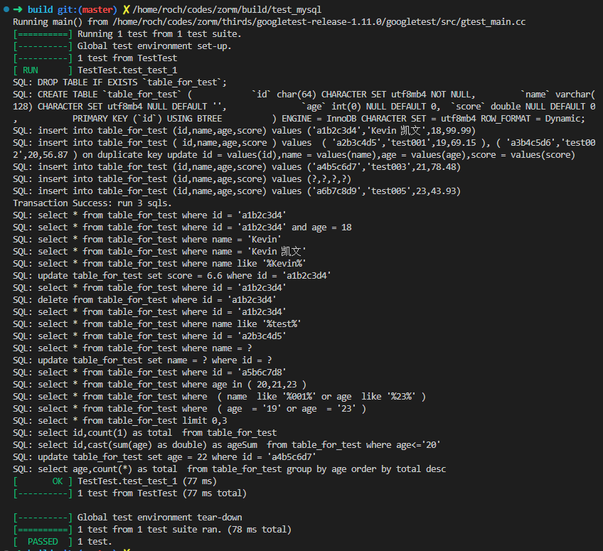

# zrom

## 介绍
我们通用的ORM，基本模式都是想要脱离数据库的，几乎都在编程语言层面建立模型，由程序去与数据库打交道。虽然脱离了数据库的具体操作，但我们要建立各种模型文档，用代码去写表之间的关系等等操作，让初学者一时如坠云雾。我的想法是，将关系数据库拥有的完善设计工具之优势，来实现数据设计以提供结构信息，让json对象自动映射成为标准的SQL查询语句。只要我们理解了标准的SQL语言，我们就能够完成数据库查询操作。

## 相关项目
本项目依赖 本人的 另一个项目 Zjson，此项目提供简洁、方便、高效的Json库。该库使用方便，是一个单文件库，只需要下载并引入项目即可。具体信息请移步 [gitee-Zjson](https://gitee.com/zhoutk/zjson.git) 或 [github-Zjson](https://github.com/zhoutk/zjson.git) 。

## 项目名称说明
本人姓名拼音第一个字母z加上orm，即得本项目名称zorm，没有其它任何意义。我将编写一系列以z开头的相关项目，命名是个很麻烦的事，因此采用了这种简单粗暴的方式。

## 设计思路 
ZORM 数据传递采用json来实现，使数据标准能从最前端到最后端达到和谐统一。此项目目标，不但在要C++中使用，还要作为动态链接库与node.js结合用使用，因此希望能像javascript一样，简洁方便的操作json。所以先行建立了zjson库，作为此项目的先行项目。设计了数据库通用操作接口，实现与底层实现数据库的分离。该接口提供了CURD标准访问，以及批量插入和事务操作，基本能满足平时百分之九十以上的数据库操作。项目基本目标，支持Sqlite3,Mysql,Postges三种关系数据库，同时支持windows、linux和macOS。

## 项目进度
  现在已经实现了sqlit3与mysql的所有功能，postgres已经完成linux和macos下的所有功能。  
  我选择的技术实现方式，基本上是最底层高效的方式。sqlit3 - sqllit3.h（官方的标准c接口）；mysql - c api （MySQL Connector C 6.1）；postgres - libpqxx7.7.4 。

任务列表：
- [x] Sqlite3 实现
  - [x] linux 
  - [x] windows
  - [x] macos
- [x] Mysql 实现
  - [x] linux 
  - [x] windows
  - [x] macos
- [x] Pstgre 实现
  - [x] linux 
  - [ ] windows
  - [x] macos

## 数据库通用接口
  > 应用类直接操作这个通用接口，实现与底层实现数据库的分离。该接口提供了CURD标准访问，以及批量插入和事务操作，基本能满足平时百分之九十以上的数据库操作。

  ```
    class ZORM_API Idb
    {
    public:
        virtual Json select(string tablename, Json& params, vector<string> fields = vector<string>(), Json values = Json(JsonType::Array)) = 0;
        virtual Json create(string tablename, Json& params) = 0;
        virtual Json update(string tablename, Json& params) = 0;
        virtual Json remove(string tablename, Json& params) = 0;
        virtual Json querySql(string sql, Json params = Json(), Json values = Json(JsonType::Array), vector<string> fields = vector<string>()) = 0;
        virtual Json execSql(string sql, Json params = Json(), Json values = Json(JsonType::Array)) = 0;
        virtual Json insertBatch(string tablename, Json& elements, string constraint = "id") = 0;
        virtual Json transGo(Json& sqls, bool isAsync = false) = 0;
    };
  ```

## 实例构造
> 全局查询开关变量：
- DbLogClose : sql 查询语句显示开关
- parameterized : 是否使用参数化查询

> Sqlite3:
```
    Json options;
    options.addSubitem("connString", "./db.db");    //数据库位置
    options.addSubitem("DbLogClose", false);        //显示查询语句
    options.addSubitem("parameterized", false);     //不使用参数化查询
    DbBase* db = new DbBase("sqlite3", options);
```
  
> Mysql:
```
    Json options;
    options.addSubitem("db_host", "192.168.6.6");   //mysql服务IP
    options.addSubitem("db_port", 3306);            //端口
    options.addSubitem("db_name", "dbtest");        //数据库名称
    options.addSubitem("db_user", "root");          //登记用户名
    options.addSubitem("db_pass", "123456");        //密码
    options.addSubitem("db_char", "utf8mb4");       //连接字符设定[可选]
    options.addSubitem("db_conn", 5);               //连接池配置[可选]，默认为2
    options.addSubitem("DbLogClose", true);         //不显示查询语句
    options.addSubitem("parameterized", true);      //使用参数化查询
    DbBase* db = new DbBase("mysql", options);
```

> Postgres:
```
    Json options;
    options.addSubitem("db_host", "192.168.6.6");
    options.addSubitem("db_port", 5432);
    options.addSubitem("db_name", "dbtest");
    options.addSubitem("db_user", "root");
    options.addSubitem("db_pass", "123456");
    options.addSubitem("db_conn", 5);
    options.addSubitem("DbLogClose", false);
    options.addSubitem("parameterized", true);
    DbBase* db = new DbBase("postgres", options);
```

## 智能查询方式设计
> 查询保留字：page, size, sort, fuzzy, lks, ins, ors, count, sum, group

- page, size, sort, 分页排序
    在sqlit3与mysql中这比较好实现，limit来分页是很方便的，排序只需将参数直接拼接到order by后就好了。  
    查询示例：
    ```
    Json p;
    p.addSubitem("page", 1);
    p.addSubitem("size", 10);
    p.addSubitem("size", "sort desc");
    (new DbBase(...))->select("users", p);
    
    生成sql：   SELECT * FROM users  ORDER BY age desc LIMIT 0,10
    ```
- fuzzy, 模糊查询切换参数，不提供时为精确匹配
    提供字段查询的精确匹配与模糊匹配的切换。
    ```
    Json p;
    p.addSubitem("username", "john");
    p.addSubitem("password", "123");
    p.addSubitem("fuzzy", 1);
    (new DbBase(...))->select("users", p);
   
    生成sql：   SELECT * FROM users  WHERE username like '%john%'  and password like '%123%'
    ```
- ins, lks, ors
    这是最重要的三种查询方式，如何找出它们之间的共同点，减少冗余代码是关键。

    - ins, 数据库表单字段in查询，一字段对多个值，例：  
        查询示例：
    ```
    Json p;
    p.addSubitem("ins", "age,11,22,36");
    (new DbBase(...))->select("users", p);

    生成sql：   SELECT * FROM users  WHERE age in ( 11,22,26 )
    ```
    - ors, 数据库表多字段精确查询，or连接，多个字段对多个值，例：  
        查询示例：
    ```
    Json p;
    p.addSubitem("ors", "age,11,age,36");
    (new DbBase(...))->select("users", p);

    生成sql：   SELECT * FROM users  WHERE  ( age = 11  or age = 26 )
    ```
    - lks, 数据库表多字段模糊查询，or连接，多个字段对多个值，例：
        查询示例：
    ```
    Json p;
    p.addSubitem("lks", "username,john,password,123");
    (new DbBase(...))->select("users", p);

    生成sql：   SELECT * FROM users  WHERE  ( username like '%john%'  or password like '%123%'  )
    ```
- count, sum
    这两个统计求和，处理方式也类似，查询时一般要配合group与fields使用。
    - count, 数据库查询函数count，行统计，例：
        查询示例：
    ```
    Json p;
    p.addSubitem("count", "1,total");
    (new DbBase(...))->select("users", p);

    生成sql：   SELECT *,count(1) as total  FROM users
    ```
    - sum, 数据库查询函数sum，字段求和，例：
        查询示例：
    ```
    Json p;
    p.addSubitem("sum", "age,ageSum");
    (new DbBase(...))->select("users", p);

    生成sql：   SELECT username,sum(age) as ageSum  FROM users
    ```
- group, 数据库分组函数group，例：  
    查询示例：
    ```
    Json p;
    p.addSubitem("group", "age");
    (new DbBase(...))->select("users", p);

    生成sql：   SELECT * FROM users  GROUP BY age
    ```

> 不等操作符查询支持

支持的不等操作符有：>, >=, <, <=, <>, =；逗号符为分隔符，一个字段支持一或二个操作。  
特殊处：使用"="可以使某个字段跳过search影响，让模糊匹配与精确匹配同时出现在一个查询语句中

- 一个字段一个操作，示例：
    查询示例：
    ```
    Json p;
    p.addSubitem("age", ">,10");
    (new DbBase(...))->select("users", p);

    生成sql：   SELECT * FROM users  WHERE age> 10
    ```
- 一个字段二个操作，示例：
    查询示例：
    ```
    Json p;
    p.addSubitem("age", ">=,10,<=,33");
    (new DbBase(...))->select("users", p);

    生成sql：   SELECT * FROM users  WHERE age>= 10 and age<= 33
    ```
- 使用"="去除字段的fuzzy影响，示例：
    查询示例：
    ```
    Json p;
    p.addSubitem("age", "=,18");
    p.addSubitem("username", "john");
    p.addSubitem("fuzzy", "1");
    (new DbBase(...))->select("users", p);

    生成sql：   SELECT * FROM users  WHERE age= 18  and username like '%john%'
    ```
 具体使用方法，请参看uint test。 

## 单元测试
有完整功能的单元测试用例，请参见tests目录下的测试用例。
> 测试用例运行结果样例


## 项目地址
```
https://gitee.com/zhoutk/zorm
或
https://github.com/zhoutk/zorm
```

## 运行方法
该项目在vs2022, gcc12.12.0(最低gcc8.5.0), clang12.0下均编译运行正常。
```
git clone https://github.com/zhoutk/zorm
cd zorm
cmake -Bbuild .

---windows
cd build && cmake --build .

---linux & macos
cd build && make

run zorm or ctest
```
- 注1：在linux下需要先行安装mysql开发库, 并先手动建立数据库 dbtest。  
在ubuntu下的命令是： apt install libmysqlclient-dev  
- 注2：在linux下需要先行安装 libpq 开发库（要求gcc版本高于8）。  
在ubuntu下的命令是： apt-get install libpq-dev  
- 注3：在macos下需要先行安装 libpqxx 开发库。  
命令是： brew install libpqxx
- 注4：在windows下，要安装postgres数据库，编译libpqxx7.7.4，命令如下：
cmake -A win32 -DBUILD_SHARED_LIBS=on -DSKIP_BUILD_TEST=on -DPostgreSQL_ROOT=/d/softs/pgsql ..
cmake --build . --config Release
cmake --install . --prefix /d/softs/libpqxx  
- 注5：在windows下，因为postgres10是支持win32的最后一个版本，所以我用了它的libpq.dll作为libpqxx的链接目标。

## 相关项目

会有一系列项目出炉，网络服务相关，敬请期待...

[gitee-Zjson](https://gitee.com/zhoutk/zjson.git) 
[github-Zjson](https://github.com/zhoutk/zjson.git)
