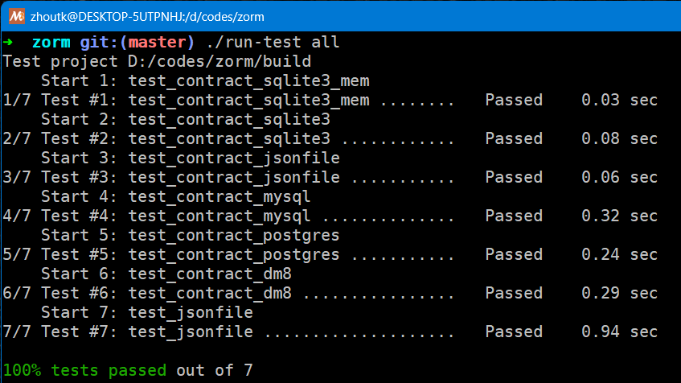

# ZORM  &emsp;&emsp;  [中文介绍](README_CN.md)  

## Introduce  
The basic models of ORM use to be separated from the database. Almost all of them build models at the level of programming language, and let the program deal with all things of the database. Although it is separated from the specific operation of the database, we have to establish various models and write the relationship between tables etc. This is very unfriendly to ordinary developers. My idea is to design tables use tools of relational databases, in our project, json objects can be automatically mapped into standard SQL. As long as we understand the standard SQL language, we can complete the database query operation. Furthermore, We can handled the relationship between tables through views or stored procedures. So our appliction can process all things only using Zorm and Json.

## Related items
This project relies on my other project Zjson, which provides a simple, convenient and efficient Json library. The library is easy to use, a single file library, you only need to download and import the project. Please move to [gitee-Zjson](https://gitee.com/zhoutk/zjson.git) or [github-Zjson](https://github.com/zhoutk/zjson.git).

## Design ideas
ZORM data transmission using json, so that data style can be unified from the front to the end. This project aims to be used not only in C++, but also as a dynamic link library used by node.js etc. So we hope to operate json concisely and conveniently like javascript. Therefore, the zjson library was established before this. The general operation interface of database is designed separating from the databases. This interface provides CURD standard api, as well as batch insert and transaction operations, which can basically cover more than 90% of normal database operations. The basic goal of the project is to support Sqlite 3, MySQL, Postges and dm8. Can running on Windows, Linux, or MacOS.

## Project characteristics
- **One interface, five backends**: `ZORM::Idb` is the public contract; sqlite3, mysql, postgres, dm8 (达梦) and jsonfile (pure-C++ file storage) implement it identically. Switching databases at runtime is switching one constructor argument.
- **Built as a small static library (`zormlib`)**: add `src/include` to your include path, include `DbBase.h`, link `zormlib` — driver headers (`mysql.h`, `DPI.h`, ...) never leak into your code. The whole stack is compiled once; executables and tests link the library instead of recompiling sources.
- **Smart query**: query parameters in plain Json are assembled into standard SQL automatically (paging, sorting, fuzzy/in/or matching, aggregates, grouping) — no model classes, no query builder DSL.
- **Upsert parity**: `create()` auto-generates an 8-hex `id` when missing and overwrites an existing row when the id is provided — the same semantics on every backend.
- **Real connection pooling**: every SQL backend pools its connections behind exclusive RAII leases (a connection belongs to exactly one statement/transaction at a time, blocking checkout, self-healing after connection failures).
- **Config-driven contract tests**: ONE test suite runs against all six backends, selected by a single config value.

## Project progress
All planned features are implemented and tested. The technical choices are the lowest-level efficient ones: sqlite3 - the official C api; mysql - C api (MINGW uses MariaDB Connector/C from pacman with an OpenSSL 3 TLS backend supporting TLSv1.2/1.3; MSVC still uses the bundled MySQL Connector C 6.1); dm8 - DPI; postgres - C api (pgsql14). The pqxx branch implements libpqxx 7.7.4, working on Linux and macOS, still problematic on Windows.

### Architecture

```
                ┌──────────────────────────────┐
   your code →  │  DbBase (factory + facade)   │   src/include + src/DbBase.cpp
                └──────────────┬───────────────┘
                               │ Idb (8 methods, frozen)
        ┌──────────────────────┼──────────────────────────┐
        ▼                      ▼                          ▼
┌───────────────────┐  ┌───────────────────┐    ┌──────────────────┐
│  SqlBackendBase   │  │   JsonFileDb      │    │                  │
│  (abstract base)  │  │   + FileLock      │    │   (sqlfile is    │
│  builders/genSql  │  │   file storage,   │    │    independent   │
│  tx loop, ONCE    │  │   own code path   │    │    of the SQL    │
└─────────┬─────────┘  └───────────────────┘    │    stack)        │
          │ virtual dialect hooks               │                  │
          │ + IDbConnection (driver surface)    │                  │
   ┌──────┼──────────┬──────────────┐           │                  │
   ▼      ▼          ▼              ▼           ▼                  │
 sqlite3  mysql   postgres        dm8        jsonfile ◄───────────┘
```

- **`SqlBackendBase`** (`src/base/SqlBackendBase.h/.cpp`) is an abstract base holding the 8 `Idb` method skeletons, the statement builders, the smart-query assembly (`genSql`), the pagination counters and the transaction loop — compiled ONCE. Backends drive their driver through the **`IDbConnection`** interface and override only the **virtual dialect hooks** that differ from the defaults.
- **`DbPool`** (`src/base/DbPool.h`) is the shared connection pool: lazily created connections up to `db_conn`, exclusive RAII `Lease` per statement (a `select` runs its main query and the records count on the same connection), blocking checkout when exhausted, `invalidate()` self-heal after fatal connection errors.
- **jsonfile** (`src/backends/JsonFileDb.h/.cpp` + `FileLock.h/.cpp`) is independent of the SQL stack: a single JSON file with a cross-process lock, atomic writes, corrupt-file backup and an O(1) per-table id index.

### Dialect hooks — who overrides what

Similar backends share the defaults naturally; only true one-offs carry overrides:

| Hook (default in `SqlBackendBase.cpp`) | sqlite3 | mysql | postgres | dm8 |
|---|---|---|---|---|
| placeholder `?` / `limit o,n` / identity quoting / comma-join projections | default | default | override ($n, `limit N OFFSET o`) | override ("quoted") |
| upsert `ON CONFLICT ... excluded` | default | override (`ON DUPLICATE KEY ... values()`) | default | — (read-then-write in `create()`) |
| literal escaping (double the quotes) | default | override (`mysql_real_escape_string`) | default | default |
| LIKE / fuzzy column | default | default | override (`CAST(col as TEXT)`) | override (quoted) |
| **overrides needed** | **0** | **2** | **5** | **9 + create/insertBatch** |

sqlite3 is pure driver code — that is the calibration point for the dedup. Adding a backend means writing a `Connection` class and overriding only the hooks your dialect writes differently.

## Project layout

```
zorm/
├── CMakeLists.txt            # zormlib static lib + demo exe + test targets
├── CMakePresets.json         # clang-dbg / clang-rlz (Ninja + MSYS2 clang64)
├── run-test                  # test runner (see "Unit test")
├── src/
│   ├── main.cpp              # demo entry (links zormlib)
│   ├── DbBase.cpp            # factory impl - the ONLY TU that sees backend headers
│   ├── GlobalConstants.cpp   # status-code message table
│   ├── include/              # ★ PUBLIC surface (4 headers, keep minimal)
│   │   ├── Idb.h             # THE unified interface (frozen)
│   │   ├── DbBase.h          # factory declaration (no driver headers leak)
│   │   ├── GlobalConstants.h # status codes (200/202/301/701/...)
│   │   └── dll_global.h      # ZORM_API macro
│   ├── base/                 # private shared algorithm layer
│   │   ├── SqlBackendBase.h/.cpp  # Idb skeletons, builders, genSql, tx loop
│   │   ├── DbConnection.h    # IDbConnection: per-connection execution surface
│   │   ├── DbPool.h          # HandlePool + exclusive RAII leases (template)
│   │   └── DbUtils.h/.cpp    # SQL/JSON helpers, GenerateId, Trim
│   └── backends/             # private per-backend pairs
│       ├── Sqlit3Db.h/.cpp   # sqlite3 (zero dialect overrides - pure driver)
│       ├── MysqlDb.h/.cpp    # mysql (upsert/escaping overrides, TLS options)
│       ├── PostgresDb.h/.cpp # postgres ($n placeholders, CAST LIKE, OFFSET)
│       ├── Dm8Db.h/.cpp      # dm8 (quoted-lowercase group, read-then-write upsert)
│       ├── JsonFileDb.h/.cpp # jsonfile backend
│       ├── FileLock.h/.cpp   # cross-process lock used by JsonFileDb
│       └── pg_type_d.h       # libpq OID table (private)
├── tests/                    # see "Unit test"
├── docs/                     # project-index, jsonfile-design, code-review record
└── thirds/                   # bundled deps: googletest, sqlite3, mysql, pq, dm8, zjson
```

## Database interface
> The interface was designed to separate operations from databases. 

```
    class ZORM_API Idb
    {
    public:
        virtual Json select(const string& tablename, const Json& params, vector<string> fields = vector<string>(), Json values = Json(JsonType::Array)) = 0;
        virtual Json create(const string& tablename, const Json& params) = 0;
        virtual Json update(const string& tablename, const Json& params) = 0;
        virtual Json remove(const string& tablename, const Json& params) = 0;
        virtual Json querySql(const string& sql, Json params = Json(), Json values = Json(JsonType::Array), vector<string> fields = vector<string>()) = 0;
        virtual Json execSql(const string& sql, Json params = Json(), Json values = Json(JsonType::Array)) = 0;
        virtual Json insertBatch(const string& tablename, const Json& elements, string constraint = "id") = 0;
        virtual Json transGo(const Json& sqls, bool isAsync = false) = 0;
    };
```

Every method returns a Json object with a `status` field. Key codes (`GlobalConstants.h`):

| Code | Meaning |
|------|---------|
| 200 | success |
| 202 | query result empty |
| 301 | param error (bad shape / missing id / malformed reserved word) |
| 700 | db connection failed |
| 701 | db operation failed (carries the driver error message) |
| 404 / 500 / 702 / 703 / 801 | see `src/include/GlobalConstants.h` |

### Behavior contract (identical on every backend)

| Call | Semantics |
|------|-----------|
| `create(table, params)` | object → insert; auto-generates an 8-hex `id` when missing/empty; **upserts** (overwrites) when a provided id already exists; returns `{status, id, insertId, affectedRows}` |
| `create(table, array)` | 1 element → delegated to the single-row path; N elements → delegated to `insertBatch` |
| `update(table, params)` | requires `id` plus at least one column to set (else 301); returns `affectedRows` |
| `remove(table, params)` | requires `id` (else 301) |
| `select(table, params, fields)` | smart query (below); always returns `records` + `pages` beside `data` |
| `querySql(sql, params, values, fields)` | raw query; `params` carry the smart-query reserved words, `values` bind to `?`/`$n` placeholders |
| `execSql(sql, params, values)` | raw statement; returns `affectedRows` |
| `insertBatch(table, elements, constraint)` | one multi-row INSERT; duplicate keys update (upsert); a single element is accepted |
| `transGo(sqls, isAsync)` | transaction, see below |

### transGo elements

A transaction is an array of elements; each element is either raw SQL text or a structured operation:

```
// raw SQL, optionally with placeholders
{ "text": "insert into users (id,name) values (?,?)", "values": ["a1b2c3d4", "john"] }

// structured operations (SQL is generated per backend, correctly quoted)
{ "table": "users", "method": "Insert", "params": {"id": "...", "name": "john"} }
{ "table": "users", "method": "Update", "id": "...", "params": {"name": "jane"} }
{ "table": "users", "method": "Delete", "id": "..." }
{ "table": "users", "method": "Batch",  "params": [ {...}, {...} ] }
```

Any statement failing rolls the whole transaction back and the failure status carries the driver error.

## Example of DbBase
> Global query switch variables:
- DbLogClose : show sql or not
- parameterized : query using parameterized or not

> Sqlite3:
```
    Json options;
    options.add("connString", "./db.db");    //where database locate
    options.add("DbLogClose", false);        //show sql
    options.add("parameterized", false);     //no parameterized
    DbBase* db = new DbBase("sqlite3", options);
```
  
> Mysql:
```
    Json options;
    options.add("db_host", "192.168.6.6");   //mysql service IP
    // SSL/TLS (optional): the client negotiates TLS automatically when the
    // server offers it; configure the options below as needed
    //options.add("db_ssl_ca", "./ca.pem");        //CA cert to verify the server
    //options.add("db_ssl_cert", "./client.pem");  //client cert (mutual TLS)
    //options.add("db_ssl_key", "./client.key");   //client private key
    //options.add("db_ssl_verify", true);          //verify server cert (default false)
    //options.add("db_ssl_required", true);        //require TLS: fail when the server cannot encrypt
    options.add("db_port", 3306);            //port
    options.add("db_name", "dbtest");        //database's name
    options.add("db_user", "root");          //username
    options.add("db_pass", "123456");        //password
    options.add("db_char", "utf8mb4");       //Connection character setting[optional]
    options.add("db_conn", 5);               //pool setting[optional]，default is 2
    options.add("DbLogClose", true);         //not show sql
    options.add("parameterized", true);      //use parameterized
    DbBase* db = new DbBase("mysql", options);
```

> Postgres:
```
    Json options;
    options.add("db_host", "192.168.6.6");
    options.add("db_port", 5432);
    options.add("db_name", "dbtest");
    options.add("db_user", "root");
    options.add("db_pass", "123456");
    options.add("db_conn", 5);
    options.add("DbLogClose", false);
    options.add("parameterized", true);
    DbBase* db = new DbBase("postgres", options);
```

> Dm8:
```
    Json options;
    options.add("db_host", "192.168.5.12");  //dm8 service IP
    options.add("db_port", 5236);            //port, default 5236
    options.add("db_name", "dbtest");        //schema name
    options.add("db_user", "SYSDBA");        //username
    options.add("db_pass", "123456");        //password
    options.add("db_char", "utf8mb4");       //Connection character setting[optional]
    options.add("db_conn", 1);               //pool setting[optional], default is 1
    options.add("DbLogClose", false);
    options.add("parameterized", true);
    DbBase* db = new DbBase("dm8", options);
```
> DM8 note: identifiers generated by zorm are always quoted lower-case; keep raw SQL in your own code quoted too (a CASE_SENSITIVE=Y server folds unquoted identifiers to upper case).

> JsonFile:
```
    Json options;
    options.add("connString", "./data.json");  //data file location, empty -> "<exe dir>/data.json"
    options.add("DbLogClose", true);           //not show sql
    DbBase* db = new DbBase("jsonfile", options);
```
  > Data is stored in a single file as a JSON array: `[{"table":"t1","columns":["id",...],"rows":[{...},...]}]`.
  > All common operations are supported (CRUD, batch insert, transactions, smart query), with a
  > cross-process file lock, atomic writes, corrupt-file backup and an O(1) per-table id index.
  > The backend is also available directly as `ZORM::JsonFile::JsonFileDb` (with a `createShared`
  > factory method).
  > Note: when a value is *text* that merely looks like JSON (`[1,2]`, `{"a":1}`), build it with
  > `Json::str(text)` - `Json(text)` would parse it into an array/object.

## Design of intelligent query use Json
> Query reserved words：page, size, sort, fuzzy, lks, ins, ors, count, sum, group

- page, size, sort &emsp;&emsp;//paging and set query order
    example：
    ```
    Json p;
    p.add("page", 1);
    p.add("size", 10);
    p.add("sort", "age desc");
    (new DbBase(...))->select("users", p);
    
    generate sql：   SELECT * FROM users  ORDER BY age desc LIMIT 0,10
    ```
- fuzzy &emsp;&emsp;//Fuzzy query switch, if not provided, it is exact matching. Provides it or not will switch between exact matching and fuzzy matching.
    ```
    Json p;
    p.add("username", "john");
    p.add("password", "123");
    p.add("fuzzy", 1);
    (new DbBase(...))->select("users", p);
   
    generate sql：   SELECT * FROM users  WHERE username like '%john%'  and password like '%123%'
    ```
- ins, lks, ors &emsp;&emsp;//Three most important query methods. How to find the common points among them is the key to reduce redundant codes.

    - ins &emsp;&emsp;//single field, multiple values：
    ```
    Json p;
    p.add("ins", "age,11,22,36");
    (new DbBase(...))->select("users", p);

    generate sql：   SELECT * FROM users  WHERE age in ( 11,22,26 )
    ```
    - ors &emsp;&emsp;//exact matching; multiple fields, multiple values：
    ```
    Json p;
    p.add("ors", "age,11,age,36");
    (new DbBase(...))->select("users", p);

    generate sql：   SELECT * FROM users  WHERE  ( age = 11  or age = 26 )
    ```
    - lks &emsp;&emsp;//fuzzy matching; multiple fields, multiple values：
    ```
    Json p;
    p.add("lks", "username,john,password,123");
    (new DbBase(...))->select("users", p);

    generate sql：   SELECT * FROM users  WHERE  ( username like '%john%'  or password like '%123%'  )
    ```
- count, sum
    > Two statistics function. 
    - count &emsp;&emsp;//count, line statistics：
    ```
    Json p;
    p.add("count", "1,total");
    (new DbBase(...))->select("users", p);

    generate sql：   SELECT *,count(1) as total  FROM users
    ```
    - sum &emsp;&emsp;//sum, columns statistics：
    ```
    Json p;
    p.add("sum", "age,ageSum");
    (new DbBase(...))->select("users", p);

    generate sql：   SELECT username,sum(age) as ageSum  FROM users
    ```
- group &emsp;&emsp;：
    ```
    Json p;
    p.add("group", "age");
    (new DbBase(...))->select("users", p);

    generate sql：   SELECT * FROM users  GROUP BY age
    ```

> Unequal operator query support

The supported operators are : >, >=, <, <=, <>, = . Comma is the separator. One field supports one or two operations.Special features: using "=" can enable a field to skip the fuzzy matching. So fuzzy matching and exact matching can appear in one query at the same time.

- one field, one operation：
    ```
    Json p;
    p.add("age", ">,10");
    (new DbBase(...))->select("users", p);

    generate sql：   SELECT * FROM users  WHERE age> 10
    ```
- two field, two operation：
    ```
    Json p;
    p.add("age", ">=,10,<=,33");
    (new DbBase(...))->select("users", p);

    generate sql：   SELECT * FROM users  WHERE age>= 10 and age<= 33
    ```
- use "=" skip fuzzy matching：
    ```
    Json p;
    p.add("age", "=,18");
    p.add("username", "john");
    p.add("fuzzy", "1");
    (new DbBase(...))->select("users", p);

    generate sql：   SELECT * FROM users  WHERE age= 18  and username like '%john%'
    ```

> Paging response shape: with `page`/`size` set, every `select` also returns
> `records` (total row count, computed on the same connection as the main query)
> and `pages` (total pages); without paging, `records` is the returned row count.
> Malformed reserved words (`ins` with a missing value, odd element counts, a
> comparison operator with three components, ...) return status 301 on every
> backend.

 Details in unit test, thanks! 

## Unit test
Config-driven contract suite (gels-style): ONE suite, SIX backends. The backend
under test is selected by a single config value in `tests/dbconfig.json`
(`db_dialect`) or the `--dialect` argument — switching the database under test
is switching one config value, exactly like refer/gels.

Backends covered by the same suite:
- `sqlite3-mem` — in-memory SQLite (no server needed)
- `sqlite3` — file-backed SQLite (no server needed)
- `jsonfile` — JSON file backend (no server needed)
- `mysql`, `postgres`, `dm8` — remote servers (see dbconfig.json)

The shared bodies assert the **intersection** of backend behavior — all 8 Idb
methods, every reserved word, type fidelity (decimal/datetime round-trips,
aggregate precision, NULL rendering) and escaping fidelity (quotes/percent/
JSON-looking text round-trip in BOTH parameterized and literal modes) — plus
parameter-error paths (301 shapes) shared by every backend.

Run (13 ctest registrations):
```
./run-test                 # default: sqlitemem + jsonfile hardening + dbutils + pool
./run-test local           # sqlitemem + sqlite(file) + json(file) + hardening + unit tests
./run-test remote          # mysql + postgres + dm8
./run-test all             # everything — the regression gate
./run-test sqlitemem       # memory sqlite only
./run-test sqlite          # file sqlite only
./run-test json            # jsonfile contract + hardening (both)
./run-test utils           # DbUtils + DbBase facade unit tests (no db at all)
./run-test pool            # HandlePool lease/blocking/invalidate tests (no db at all)
./run-test mysqlplain      # mysql with parameterized=false (literal-SQL paths)
./run-test sqliteplain     # sqlitemem with parameterized=false (same)
./run-test pgplain         # postgres with parameterized=false (same)
./run-test dmplain         # dm8 with parameterized=false (same)
```

Every SQL dialect is registered twice (default + `*plain`): literal-SQL
generation, escaping and non-parameterized decoding are separate code paths.
The jsonfile backend has its own storage-engine hardening suite (corrupt-file
backup, cross-process lock, atomic write, memory-vs-disk consistency, UTF-8
validation). `./run-test json` runs it together with the shared contract suite.
Backend-independent units (DbUtils helpers, the DbBase facade validation, the
connection pool) have their own offline unit tests — no database involved.
> See [docs/jsonfile-design.md](docs/jsonfile-design.md) for the design and
> the full test breakdown.
> Example of test case running results


## Project site
```
https://gitee.com/zhoutk/zorm
or
https://github.com/zhoutk/zorm
```

## run guidance
The project is built in vs2022, gcc12.12.0(at lest gcc8.5.0), clang12.0 success。
```
git clone https://github.com/zhoutk/zorm
cd zorm
cmake -Bbuild .

---windows
cd build && cmake --build .

---linux & macos
cd build && make

run zorm or ctest
```
Build artifacts land in `bin/`: the demo executable `zorm` (plus the test
binaries when tests are enabled). On MSYS2/clang64 the presets are faster:
`cmake --preset clang-dbg` then `cmake --build build`; `./run-test` handles
the DLL paths for the tests.

To consume zorm in your own project: add this repository (or an installed
copy) with `add_subdirectory`, then link `zormlib` and add `src/include` to
your include path — that is the whole public surface.

- note 1：on linux need mysql dev lib and create a db named dbtest first.
the command of ubuntu： apt install libmysqlclient-dev  
- note 2：on linux need libpq dev lib (gcc at least 8).
the command of ubuntu： apt-get install libpq-dev  
- note 3：on macos need postgresql@14.  
the command is ： brew install postgresql@14
- note 4：On windows, if yout want use branch pqxx, need compile libpqxx7.7.4, as follows：
cmake -A x64 -DBUILD_SHARED_LIBS=on -DSKIP_BUILD_TEST=on -DPostgreSQL_ROOT=/d/softs/pgsql ..
cmake --build . --config Release
cmake --install . --prefix /d/softs/libpqxx  
- note 5：on windows, postgres10 is the last version which support win32, So I only support the x64 version using pg14。
- note 6: About pqxx branch, on windows, postgres can only link libpqxx7.7.4's dll using debug version, and run with a Expression:__acrt_first_block==header, I'm try to solve it ...

## Associated projects

[gitee-Zjson](https://gitee.com/zhoutk/zjson.git) 
[github-Zjson](https://github.com/zhoutk/zjson.git)
